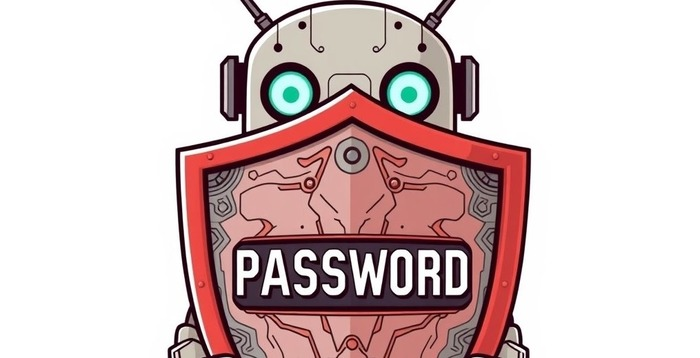

# Apache Tomcat - Password Security Auditor Tool



## Overview

**Apache Tomcat - Password Security Auditor Tool** is a set of tools designed to audit Apache Tomcat user authentication configurations for compliance with **NIST 800-53 IA-5** and **CIS Tomcat Benchmark** standards. This repository includes scripts for both Unix (Linux/macOS) and Windows environments, enabling system administrators and security professionals to evaluate password security across various Tomcat versions.

### Key Features
- **Automated Testing**: Scripts test multiple password types and credential handler configurations, modifying `server.xml` and `tomcat-users.xml` to simulate scenarios and validate compliance.
- **Manual Auditing**: Analyze existing configurations, reporting password types, credential handlers, and compliance status with actionable recommendations.
- **Cross-Platform Support**: Python-based scripts for Unix (Linux/macOS) and PowerShell scripts for Windows.
- **Backup and Restore**: Automatically back up and restore configuration files during testing to prevent data loss.
- **Detailed Logging**: Logs audit and test results to platform-specific locations for traceability.
- **Compliance Reporting**: Identifies secure/insecure configurations and provides guidance for achieving compliance.

### Supported Tomcat Versions
| Version | Unix Support | Windows Support | Notes |
|---------|--------------|-----------------|-------|
| 7.0     | ✅           | ✅              | Supports `MessageDigestCredentialHandler` (MD5, SHA-1, SHA-256). |
| 8.5     | ✅           | ✅              | Adds SHA-512 and `NestedCredentialHandler` support. |
| 9.0     | ✅           | ✅              | Includes `SecretKeyCredentialHandler` for PBKDF2. |
| 10.0    | ✅           | ✅              | Supports `SecretKeyCredentialHandler` and `NestedCredentialHandler`. |
| 10.1    | ✅           | ✅              | Identical features to 10.0. |

### Repository Contents
#### Auditing and Installation Scripts
- **Unix Scripts**:
  - `CheckTomcatConfigUnix.py`: Audits Tomcat configurations on Unix systems.
  - `tomcat_manager.sh`: Installs/uninstalls Tomcat 7.0, 8.5, 9.0, 10.0, or 10.1 on Unix.
- **Windows Scripts**:
  - `CheckTomcatConfigWin.ps1`: Audits Tomcat configurations on Windows.
  - `TomcatManager.ps1`: Installs/uninstalls Tomcat 7.0, 8.5, 9.0, 10.0, or 10.1 on Windows.
- **Documentation**:
  - `README.md`: This file, detailing setup, usage, and configuration.
  - `LICENSE`: Apache 2.0 License details.
- **Assets**:
  - `assets/` folder: Contains the project banner image (`banner.png`) used in this README.

#### Testing Scripts
- **Test Scripts**:
  - `test_config_unix.py`: Automated testing to verify the functionality of `CheckTomcatConfigUnix.py`.
  - `test_config_win.ps1`: Automated testing to verify the functionality of `CheckTomcatConfigWin.ps1`.
  - `test/` folder: Contains test scripts and resources for validating the auditing scripts (`CheckTomcatConfigUnix.py` and `CheckTomcatConfigWin.ps1`). These tests confirm that the auditing scripts correctly identify and report compliance issues.

## Prerequisites

### Unix (Linux/macOS)
- **Python**: 3.6 or later.
- **Tomcat**: 7.0, 8.5, 9.0, 10.0, or 10.1 installed (e.g., `/opt/tomcat`).
- **Permissions**: Write access to Tomcat’s `conf` directory and root/sudo privileges for installation.
- **Dependencies**: `wget`, `curl`, `sha512sum` for `tomcat_manager.sh`.
- **OpenJDK**: Java 8 for Tomcat 7.0, Java 11 for Tomcat 8.5, 9.0, 10.0, 10.1.
- **System**: Tested on Kali Linux; compatible with Ubuntu, Debian, CentOS, and other Linux distributions.

### Windows
- **PowerShell**: 5.1 or later (included in Windows 10/11).
- **Tomcat**: 7.0, 8.5, 9.0, 10.0, or 10.1 installed (e.g., `C:\tomcat`).
- **Permissions**: Write access to Tomcat’s `conf` directory and Administrator privileges for installation.
- **Java**: Java 8 for Tomcat 7.0, Java 11 for Tomcat 8.5, 9.0, 10.0, 10.1.
- **System**: Tested on Windows 10/11; compatible with Windows Server editions.

## Setup

### Unix (Linux/macOS)
1. **Clone Repository**:
   ```bash
   git clone <repository-url> /home/user/tomcat-audit
   cd /home/user/tomcat-audit
   ```
2. **Set Permissions**:
   ```bash
   chmod +x CheckTomcatConfigUnix.py test_config_unix.py tomcat_manager.sh
   ```
3. **Install Tomcat** (if needed):
   Use `tomcat_manager.sh` to install Tomcat:
   ```bash
   sudo ./tomcat_manager.sh install 9    # Install Tomcat 9.0
   sudo ./tomcat_manager.sh install 8.5  # Install Tomcat 8.5
   sudo ./tomcat_manager.sh install 7    # Install Tomcat 7.0
   sudo ./tomcat_manager.sh install 10.0 # Install Tomcat 10.0
   sudo ./tomcat_manager.sh install 10.1 # Install Tomcat 10.1
   ```
4. **Uninstall Tomcat** (if needed):
   ```bash
   sudo ./tomcat_manager.sh uninstall
   ```
5. **Install Python** (if needed):
   ```bash
   sudo apt update && sudo apt install python3  # Ubuntu/Debian/Kali
   sudo yum install python3                   # CentOS/RHEL
   ```
6. **Install Java** (if needed):
   ```bash
   # For Tomcat 7.0
   sudo apt install openjdk-8-jdk  # Ubuntu/Debian/Kali
   sudo yum install java-1.8.0-openjdk-devel  # CentOS/RHEL
   # For Tomcat 8.5, 9.0, 10.0, 10.1
   sudo apt install openjdk-11-jdk  # Ubuntu/Debian/Kali
   sudo yum install java-11-openjdk-devel  # CentOS/RHEL
   ```
7. **Verify Tomcat**:
   ```bash
   ls -l /opt/tomcat/conf/server.xml /opt/tomcat/conf/tomcat-users.xml
   ```

### Windows
1. **Clone Repository**:
   ```powershell
   git clone <repository-url> C:\Users\<User>\tomcat-audit
   cd C:\Users\<User>\tomcat-audit
   ```
2. **Set Execution Policy** (if needed):
   ```powershell
   Set-ExecutionPolicy -Scope CurrentUser -ExecutionPolicy RemoteSigned
   ```
3. **Install Tomcat** (if needed):
   Use `TomcatManager.ps1` to install Tomcat:
   ```powershell
   .\TomcatManager.ps1 install 9    # Install Tomcat 9.0
   .\TomcatManager.ps1 install 8.5  # Install Tomcat 8.5
   .\TomcatManager.ps1 install 7    # Install Tomcat 7.0
   .\TomcatManager.ps1 install 10.0 # Install Tomcat 10.0
   .\TomcatManager.ps1 install 10.1 # Install Tomcat 10.1
   ```
4. **Uninstall Tomcat** (if needed):
   ```powershell
   .\TomcatManager.ps1 uninstall
   ```
5. **Install Java** (if needed):
   - Download from `https://adoptium.net/` or `https://www.oracle.com/java/`.
   - For Tomcat 7.0: Install Java 8.
   - For Tomcat 8.5, 9.0, 10.0, 10.1: Install Java 11.
   - Set `JAVA_HOME` environment variable:
     ```powershell
     [Environment]::SetEnvironmentVariable("JAVA_HOME", "C:\Program Files\Java\jdk-11", "Machine")
     ```
6. **Verify Tomcat**:
   ```powershell
   dir "C:\tomcat\conf\server.xml"
   dir "C:\tomcat\conf\tomcat-users.xml"
   ```

## Usage

### Auditing Scripts

#### Unix: Manual Auditing
Audit current configuration:
```bash
sudo ./CheckTomcatConfigUnix.py
```
- **Output**: Logs to `/tmp/TomcatManager.log`.
- **Example** (secure):
  ```
  Checking Apache Tomcat configuration security...
  Detected Tomcat version 9.0 at /opt/tomcat/conf
  - User 'testuser': Salted_PBKDF2 password (secure)
    - Parameter: Password Type = Salted_PBKDF2 [PASS]
    - Status: Compliant with NIST 800-53 IA-5 and CIS Tomcat Benchmark
  Overall Configuration: Secure
  ```

#### Windows: Manual Auditing
Audit current configuration:
```powershell
.\CheckTomcatConfigWin.ps1
```
- **Output**: Logs to `$env:LOCALAPPDATA\Temp\TestTomcatConfig.log`.
- **Example** (secure):
  ```
  Checking Apache Tomcat configuration security...
  Detected Tomcat version 10.0 at C:\tomcat\conf
  - User 'testuser': Salted_PBKDF2 password (secure)
    - Parameter: Password Type = Salted_PBKDF2 [PASS]
    - Status: Compliant with NIST 800-53 IA-5 and CIS Tomcat Benchmark
  Overall Configuration: Secure
  ```

### Testing Scripts
The testing scripts (`test_config_unix.py` and `test_config_win.ps1`) are designed to verify the functionality of the auditing scripts (`CheckTomcatConfigUnix.py` and `CheckTomcatConfigWin.ps1`). They simulate various Tomcat configurations and password types to ensure the auditing scripts correctly identify and report compliance with NIST 800-53 IA-5 and CIS Tomcat Benchmark standards. The `test/` folder contains additional resources and scripts to support these tests.

#### Unix: Automated Testing
Run tests to verify `CheckTomcatConfigUnix.py`:
```bash
sudo ./test_config_unix.py
```
- **Output**: Logs to `~/TestTomcatConfig.log`.
- **Test Cases**:
  - Tomcat 7.0: 42 tests (6 server configs × 7 password types).
  - Tomcat 8.5: 42 tests.
  - Tomcat 9.0: 42 tests.
  - Tomcat 10.0: 42 tests.
  - Tomcat 10.1: 42 tests.
- **Example**:
  ```
  Starting tests for CheckTomcatConfigUnix.py...
  Found Tomcat at /opt/tomcat/conf, version: 9.0
  Test: 9.0_SecretKey_PBKDF2_Salted_PBKDF2
    Description: Testing Salted_PBKDF2 password with SecretKey_PBKDF2 CredentialHandler
    Result: PASSED
  Test Summary:
    Total tests run: 42
    Tests passed: 42
    Tests failed: 0
  ```

#### Windows: Automated Testing
Run tests to verify `CheckTomcatConfigWin.ps1`:
```powershell
.\test_config_win.ps1
```
- **Output**: Logs to `$env:LOCALAPPDATA\Temp\TestTomcatConfig.log`.
- **Test Cases**:
  - Tomcat 7.0: 15 tests (3 server configs × 5 password types).
  - Tomcat 8.5: 35 tests (5 server configs × 7 password types).
  - Tomcat 9.0/10.0/10.1: 42 tests each (6 server configs × 7 password types).
- **Example**:
  ```
  [2025-04-23 14:10:00] Detected Tomcat version 10.0 at C:\tomcat\conf
  [2025-04-23 14:10:00] Running test: 10.0_SecretKeyCredentialHandler_PBKDF2_Salted_PBKDF2
  Test output: - User 'testuser': Salted_PBKDF2 password (secure)
  [2025-04-23 14:10:05] All tests completed successfully
  ```

## Configuration Recommendations

### Best Compliance Configurations
| Tomcat Version | Configuration | Notes |
|----------------|---------------|-------|
| **7.0**        | `MessageDigestCredentialHandler`, SHA-256, Hashed_SHA256 | Strongest supported algorithm; no salt/iterations. |
| **8.5**        | `MessageDigestCredentialHandler`, SHA-512, ≥10,000 iterations, ≥16-byte salt, Hashed_SHA512 | SHA-256 also compliant. |
| **9.0/10.0/10.1** | `SecretKeyCredentialHandler`, PBKDF2WithHmacSHA512, ≥10,000 iterations, ≥16-byte salt, 256-bit key, Salted_PBKDF2 | SHA-512 with `MessageDigestCredentialHandler` also compliant. |

### Example Configuration (Tomcat 9.0/10.0/10.1)
Add to `server.xml`:
```xml
<Realm className="org.apache.catalina.realm.UserDatabaseRealm" resourceName="UserDatabase">
  <CredentialHandler className="org.apache.catalina.realm.SecretKeyCredentialHandler"
                    algorithm="PBKDF2WithHmacSHA512"
                    iterations="10000"
                    saltLength="16"
                    keyLength="256"/>
</Realm>
```
Add to `tomcat-users.xml`:
```xml
<tomcat-users>
  <user username="testuser" password="4b6f7e8c9d0a1b2c3d4e5f60718293a4:1234567890abcdef" roles="manager"/>
</tomcat-users>
```

### Supported Password Types
- **Plaintext**: Insecure, non-compliant.
- **Hashed_MD5**: 32-char hex, insecure.
- **Hashed_SHA1**: 40-char hex, insecure.
- **Hashed_SHA256**: 64-char hex, secure with proper handler.
- **Hashed_SHA512**: 128-char hex, secure (8.5+).
- **Salted_MD5**: 32-char hex with 16-char salt, insecure.
- **Salted_PBKDF2**: 32-char hex with 16-char salt, secure (9.0+).

## Logging
- **Unix**:
  - Tests: `~/TestTomcatConfig.log`.
  - Audits/Installation: `/tmp/TomcatManager.log`.
- **Windows**:
  - Tests/Audits: `$env:LOCALAPPDATA\Temp\TestTomcatConfig.log` (e.g., `C:\Users\<User>\AppData\Local\Temp`).
  - Installation: `$env:TEMP\TomcatManager.log` (e.g., `C:\Users\<User>\AppData\Local\Temp`).

## Troubleshooting

### Unix
- **Tomcat Not Found**:
  - Ensure Tomcat is installed (`sudo ./tomcat_manager.sh install 9`).
  - Check `/opt/tomcat` or other paths listed in `CheckTomcatConfigUnix.py`.
- **Permission Issues**:
  - Run scripts with `sudo`.
  - Ensure write access to `/opt/tomcat/conf` and `/tmp`.
- **Download Failures**:
  - Check `/tmp/TomcatManager.log` for errors.
  - Manually download Tomcat archive and place in `/tmp`:
    ```bash
    wget https://archive.apache.org/dist/tomcat/tomcat-9/v9.0.104/bin/apache-tomcat-9.0.104.tar.gz -O /tmp
    sudo ./tomcat_manager.sh install 9
    ```
- **Java Version Issues**:
  - Verify Java version:
    ```bash
    java -version
    ```
  - Update alternatives if needed:
    ```bash
    sudo update-alternatives --config java
    ```

### Windows
- **Tomcat Not Found**:
  - Verify installation path (e.g., `C:\tomcat`).
  - Ensure `server.xml` and `tomcat-users.xml` exist in the `conf` directory.
- **Permission Issues**:
  - Run PowerShell as Administrator.
  - Ensure write access to Tomcat’s `conf` directory and `$env:LOCALAPPDATA\Temp`.
- **Java Issues**:
  - Verify Java installation and `JAVA_HOME`:
    ```powershell
    java -version
    echo $env:JAVA_HOME
    ```
  - If incorrect, update `JAVA_HOME`:
    ```powershell
    [Environment]::SetEnvironmentVariable("JAVA_HOME", "C:\Program Files\Java\jdk-11", "Machine")
    ```
- **Execution Policy**:
  - If scripts fail to run, check execution policy:
    ```powershell
    Get-ExecutionPolicy
    ```
  - Set to `RemoteSigned` if needed:
    ```powershell
    Set-ExecutionPolicy -Scope CurrentUser -ExecutionPolicy RemoteSigned
    ```

## Contributing
Contributions are welcome! Submit pull requests or issues via the repository’s hosting platform. Ensure changes are tested across supported Tomcat versions and platforms.

## License
This project is licensed under the Apache 2.0 License. See `LICENSE` file for details.
